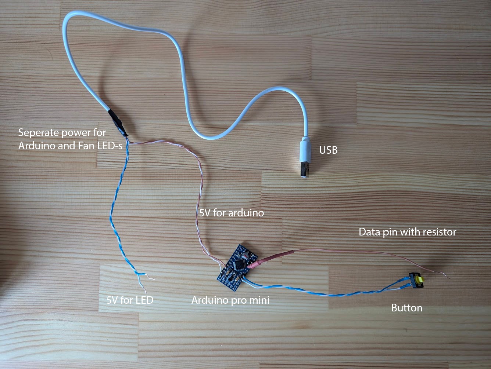
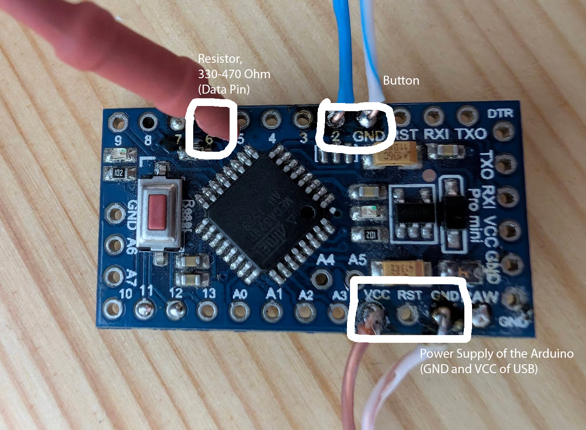
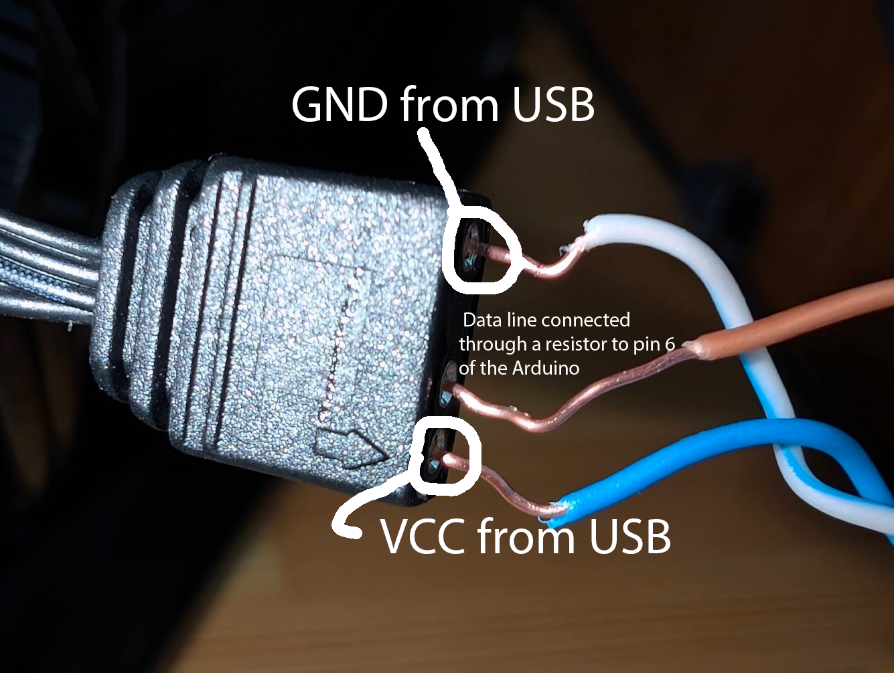

# Arduino ARGB Fan Controller

This project demonstrates how to control an **ARGB fan (WS2812-based)** using an **Arduino Pro Mini** (or any Arduino board) and the **FastLED library**.  
You can switch between different lighting modes (OFF, solid colors, rainbow) using a **push button**.

---

## Features
- Control **ARGB fans** with **addressable LEDs (WS2812 or similar)**.
- Cycle through modes using a **single button**.
- Modes included:
1. **OFF**
2. **Solid Red**
3. **Solid Green**
4. **Solid Blue**
5. **Rainbow Animation**
- Easily extendable: add more modes like breathing, color wipe, theater chase.

---

## Hardware Required
- **Arduino Pro Mini** (3.3V or 5V) or any Arduino-compatible board.
- **ARGB Fan** (WS2812 or compatible).
- **Push Button**.
- **Resistor**: 330Ω - 470Ω for the data line.
- **USB-to-Serial adapter** (for Arduino).
- **External 5V power supply or USB of your pc** (for the fan, capable of at least 1A).

---

## Wiring Diagram

| Component    | Arduino Pin  |
|-------------|-------------|
| ARGB Data   | D6          |
| Button      | D2 (other side to GND) |
| ARGB +5V    | 5V external supply |
| ARGB GND    | Common GND with Arduino |

### **Additional Notes**
- **Resistor**  in series with **data pin** to protect LEDs.
- If using **3.3V Pro Mini**, use a **logic level shifter** for data line to 5V.

---

## Installation
1. Install the [**FastLED** library](https://github.com/FastLED/FastLED) via Arduino IDE Library Manager:  
    -   Sketch → Include Library → Manage Libraries → Search for "FastLED"
3. Copy the provided code into Arduino IDE.
4. Select your board:
    -   `Arduino Pro or Pro Mini (ATmega328P, 3.3V or 5V)`.
4. Upload the sketch.

---

## License
- This project is open-source. You can use and modify it freely.

---

## Author
Developed by [Armen Balagyozyan](https://github.com/gaxkalik) — feel free to contribute or fork!

---

## Contact
For questions, email [gaxkalik@gmail.com](gaxkalik@gmail.com).
